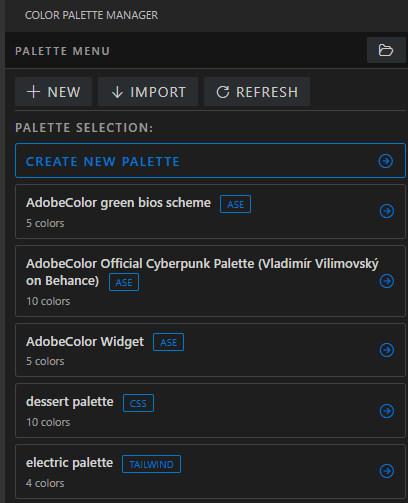
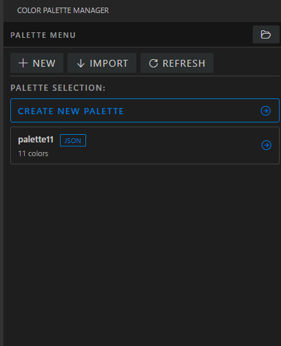
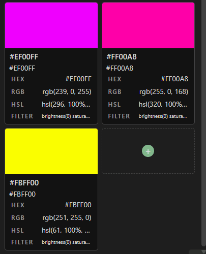
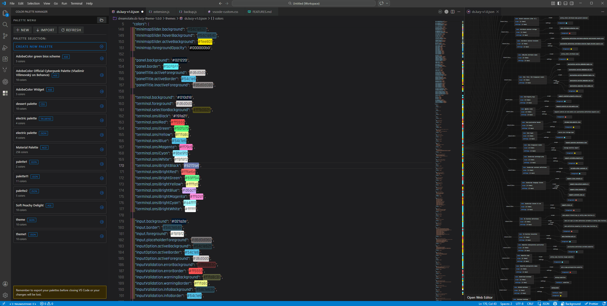
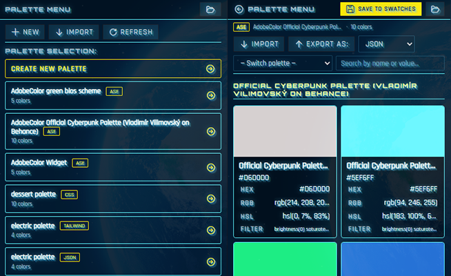

Extension is in a preview state, there will be changes in the coming weeks before it's finalized. Information in the README is up to date for the extension. -ds

# Color Palette Manager

View, edit, and manage color palettes directly in VS Code. Supports **ACO**, **ASE**, **JSON**, **CSS**, and **Tailwind** formats with full import/export, an inline color picker, drag-and-drop reordering, and real-time search.

<table>
  <tr>
    <td align="center" width="33%">
      <br/>
      <sub><b>Palette Menu & Viewer</b></sub>
    </td>
    <td align="center" width="33%">
      <br/>
      <sub><b>Create & Quick-Save</b></sub>
    </td>
    <td align="center" width="33%">
      <br/>
      <sub><b>Edit Swatches</b></sub>
    </td>
  </tr>
</table>

<details>
<summary><b>🎨 Theme Adaptation & Custom Text Effects — click to expand</b></summary>

<br/>

The extension follows your active VS Code color theme automatically. All borders, backgrounds, badges, and buttons pull from your theme's color tokens so it feels native whether you're on a light, dark, or high-contrast theme.

**Custom fonts and text effects** (like the effect seen below with a custom theme of mine) can be applied via the included `TEXT_EFFECTS.css` file. VS Code's webview sidebar runs in a sandboxed iframe that blocks external CSS injection from theme extensions — meaning theme-level style overrides like SynthWave '84's neon glow can't reach inside extension panels automatically. `TEXT_EFFECTS.css` works around this by loading the effects directly into the webview's own stylesheet, so you get the full aesthetic without any sandbox violations.

<br/>



<br/>



<br/>

</details>

---

## Features

- **Multi-format support** — import and export ACO, ASE, JSON, CSS variables, and Tailwind config files
- **Sidebar palette manager** — dedicated activity bar icon with a browsable palette menu and auto-refreshing file list
- **Visual swatch grid** — two-column card layout showing every color with its name, hex, and all format values
- **Click to copy** — click any format row (HEX, RGB, HSL, HEXA, RGBA, HSLA, CSS Filter) to copy it to the clipboard
- **Inline color picker** — add new colors with a full-featured picker (hue, saturation, brightness, opacity)
- **Edit in place** — rename colors inline, delete with one click, drag-and-drop to reorder
- **Search** — real-time filtering by name, hex, RGB, HSL, or group
- **Alpha support** — full transparency handling with HEXA, RGBA, and HSLA displayed when alpha < 1
- **CSS Filter output** — a complete `filter:` chain to reproduce any color from black, useful for SVG icon tinting
- **Group labels** — ASE groups and JSON group fields are preserved and displayed as section headers
- **Spot color indicator** — ASE spot colors are marked with a dot on the swatch
- **Save to Swatches** — persist palettes to `~/.vscode/swatches` with automatic filename incrementing
- **Palette switcher** — jump between saved palettes without leaving the editor view
- **Full theme integration** — all UI colors follow your VS Code theme

---

## Supported Formats

| Format | Import | Export |
|--------|:------:|:------:|
| ACO (Adobe Color / Photoshop) | ✓ | ✓ |
| ASE (Adobe Swatch Exchange) | ✓ | ✓ |
| JSON | ✓ | ✓ |
| CSS custom properties | ✓ | ✓ |
| Tailwind config (.js/.ts) | ✓ | ✓ |

### Color Spaces Parsed

ACO/ASE files support RGB, HSB/HSV, CMYK, CIE Lab, and Grayscale — all automatically converted to RGB. Text formats accept hex (3/4/6/8-digit), `rgb()`/`rgba()`, and `hsl()`/`hsla()` notation.

---

## Usage

1. Click the **Color Palette Manager** icon in the activity bar
2. Select a palette from the list, create a new one, or click **Import** to open any supported file
3. Click any format row on a swatch card to copy that value
4. Use the **Export as** dropdown to save in any format
5. Click **Save to Swatches** to persist your work

---

## Settings

| Setting | Type | Default | Description |
|---------|------|---------|-------------|
| `acoViewer.paletteFolder` | string | `~/.vscode/swatches` | Folder where palettes are stored |
| `acoViewer.fontFamily` | string | *(empty)* | Custom font family for the UI (e.g. `Cascadia, Fira, monospace`) |

---

## Commands

| Command | Title |
|---------|-------|
| `acoViewer.openFile` | Swatch Viewer: Open palette file… |

---


## Security

<details>
<summary><b>🔒 Security details — click to expand</b></summary>

<br/>

**Content Security Policy**
Both webviews enforce a strict CSP: `default-src 'none'`, `connect-src 'none'`, `frame-src 'none'`, `object-src 'none'`. Scripts and styles are restricted to nonce-based or `cspSource` origins — no inline execution, no remote resources.

**Nonce generation**
A fresh cryptographically-secure nonce (`crypto.randomBytes`) is generated on every HTML render. Nonces are never reused or static.

**HTML escaping**
All user-provided strings — palette names, file paths, color values, error messages — are escaped before insertion into HTML via `escHtmlHost()` on the extension host and `escHtml()` in the webview. No raw user data is ever written directly into markup.

**Local resource roots**
Webview resource access is restricted to the extension's own URI. The filesystem is not broadly exposed.

**Path traversal prevention**
`loadPalette` validates that resolved file paths stay within the swatches folder. Palette names are sanitized with `path.basename()` and special character stripping before any filesystem operation.

**Message validation**
All incoming webview messages are type-checked (`typeof`, `Array.isArray`, object shape) before processing. Unknown message types are silently dropped — no command is ever executed directly from a message value.

**Export format allowlist**
Export only accepts `json`, `css`, `tailwind`, `aco`, `ase`. Any other value is rejected before any file operation begins.

**Clipboard length limit**
Copy values are capped at 500 characters to prevent abuse of the clipboard API.

**Font family sanitization**
Custom font values from `acoViewer.fontFamily` have `{}<>;` characters stripped before being injected into CSS, preventing CSS injection via workspace settings.

**Untrusted workspace support**
`capabilities.untrustedWorkspaces` is set to `limited`. Both `acoViewer.paletteFolder` and `acoViewer.fontFamily` are restricted configurations — they are ignored in untrusted workspaces and a visible warning banner is shown to the user.

**No secrets or network access**
The extension stores no tokens or credentials and makes zero outbound network requests.

**Zero dependency CVEs**
`npm audit` reports no known vulnerabilities across all dependencies.

</details>

## Acknowledgements

- [Pickr](https://github.com/Simonwep/pickr) by Simon Reinisch — MIT License
- [VS Code Codicons](https://github.com/microsoft/vscode-codicons) by Microsoft — [CC-BY-4.0](https://creativecommons.org/licenses/by/4.0/)

---

## Installing Locally

**Option A — Install as VSIX (recommended)**

```bash
npm install
npm run package
```

Then in VS Code: **Extensions panel → `···` → Install from VSIX** and select the generated `.vsix` file. You can uninstall it cleanly through the Extensions panel like any other extension.

---

**Option B — Manual folder install (no packaging needed)**

1. Clone or download this repo
2. Run `npm install` inside the folder to install dependencies
3. Rename the folder to match the format `publisher.extensionname-version`, e.g.:
   ```
   yourname.color-palette-manager-1.0.0
   ```
4. Copy the entire folder (including `node_modules`) into your VS Code extensions directory:
   - **Windows:** `%USERPROFILE%\.vscode\extensions\`
   - **Mac/Linux:** `~/.vscode/extensions/`
5. Restart VS Code or run **Developer: Reload Window** from the command palette

> The folder name format must match exactly — `publisher.name-version` — and the version must match what's in `package.json` or VS Code won't load it.

---

**Option C — Development mode (best for testing/debugging)**

Open the project folder in VS Code and press **F5**. This launches a new Extension Development Host window with the extension loaded live, full debugger access, and console output in the original window. No copying or packaging needed.
